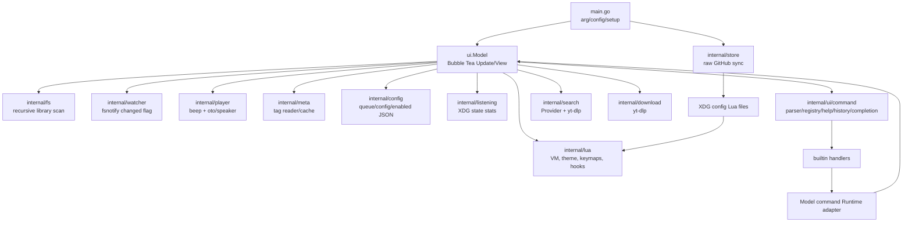

# pmusic Teknik Denetim Raporu

**Denetim tarihi:** 16 Temmuz 2026  
**İncelenen çalışma ağacı:** `main`, `5a5e042` (`Arayüz ve İndirme Yöneticisi değişiklikleri`) ve denetim başlamadan önce çalışma ağacında bulunan değişiklikler  
**Repository kökü:** `/home/padros/Projects/pmusic`  
**Kapsam:** Mimari, kod kalitesi, güvenilirlik, güvenlik, performans, test, TUI/UX, build, paketleme ve dokümantasyon  
**Yöntem:** Kaynak ve bağımlılık kodunun salt-okunur incelenmesi; ağ kapalı, modül değişiklikleri yasak ve tüm build/test önbellekleri ile çıktıları `/tmp` altında olacak şekilde doğrulama

> **Önemli kapsam notu:** Çalışma ağacı denetim başlangıcında temiz değildi. README ve komut sistemi dosyalarında değişiklikler, izlenmeyen `Makefile` ve `internal/listening/` içeriği zaten vardı. Bu rapor yalnızca `HEAD`'i değil, kullanıcının istediği üzere mevcut repository durumunu değerlendirir. Denetim bu dosyaları değiştirmedi.

## İçindekiler

1. [Yönetici özeti](#1-yönetici-özeti)
2. [Proje envanteri](#2-proje-envanteri)
3. [Mimari analiz](#3-mimari-analiz)
4. [Dosya ve modül incelemesi](#4-dosya-ve-modül-incelemesi)
5. [Kod kalitesi](#5-kod-kalitesi)
6. [C ve bellek güvenliği incelemesi](#6-c-ve-bellek-güvenliği-incelemesi)
7. [Haricî komut ve süreç güvenliği](#7-haricî-komut-ve-süreç-güvenliği)
8. [Performans analizi](#8-performans-analizi)
9. [Hata yönetimi ve güvenilirlik](#9-hata-yönetimi-ve-güvenilirlik)
10. [Kullanıcı deneyimi ve terminal arayüzü](#10-kullanıcı-deneyimi-ve-terminal-arayüzü)
11. [Test analizi](#11-test-analizi)
12. [Build, dağıtım ve paketleme](#12-build-dağıtım-ve-paketleme)
13. [Dokümantasyon incelemesi](#13-dokümantasyon-incelemesi)
14. [Teknik borç envanteri](#14-teknik-borç-envanteri)
15. [Refactor önerileri](#15-refactor-önerileri)
16. [Özellik geliştirmeye uygunluk](#16-özellik-geliştirmeye-uygunluk)
17. [Önceliklendirilmiş yol haritası](#17-önceliklendirilmiş-yol-haritası)
18. [En değerli ilk 10 görev](#18-en-değerli-ilk-10-görev)
19. [Çalıştırılan komutlar](#19-çalıştırılan-komutlar)
20. [Sonuç](#20-sonuç)

---

## 1. Yönetici özeti

### Proje ne yapıyor?

pmusic, yerel MP3/FLAC/WAV kitaplığını tarayan, Bubble Tea ile terminal arayüzü sunan ve `beep`/`oto` üzerinden ses çalan bir Go uygulamasıdır. Yerel arama, kalıcı kuyruk, dinleme istatistikleri, Vim benzeri `:` komut modu, Lua tema/eklenti sistemi, fsnotify tabanlı canlı yenileme ve `yt-dlp` ile YouTube arama/yerel indirme akışı sunar. Giriş akışı `main.go:14-43`, ana model `internal/ui/model.go:64-213`, oynatma çekirdeği `internal/player/player.go:50-329` içindedir.

### Karşıladığı ihtiyaç

Grafik uygulamaya geçmeden klavye ağırlıklı yerel müzik yönetimi ve dinleme deneyimi sağlar. Arayüz, yerel dosyayı temel alan çevrimdışı kullanımı korurken seçime dayalı çevrim içi arama/indirme ve Lua ile özelleştirme ekler (`README.md:20-37`, `README.md:152-180`).

### Geliştirme olgunluğu

**Erken beta / aktif geliştirme** düzeyindedir. İşlev seti geniş, komut alt sistemi beklenenden iyi ayrıştırılmış ve mevcut testler başarılıdır; ancak oynatma kilit sırası, ses başlatma hatasının yutulması, modal olay yönlendirmesi ve uzaktan Lua senkronizasyonunun güven modeli günlük kullanım güvenilirliğini sınırlar. Release mühendisliği de olgun değildir: CI ve paket tarifi yoktur; module yolu ile belgelenen repository yolu uyuşmaz; 13,1 MB'lık Linux debug binary'si Git'te izlenmektedir.

### En güçlü üç yön

1. **Komut sistemi iyi bir çekirdeğe sahip.** Parser, registry, completion, history, help ve typed error'lar ayrıdır; metadata tek registry'de toplanmıştır (`internal/ui/command/*.go`, özellikle `types.go:9-123`, `registry.go:17-89`). Komut paketi coverage'ı %76,9'dur.
2. **Haricî süreçlerde shell kullanılmıyor.** Arama ve indirme `exec.CommandContext` ile argüman dizisi kullanır; stderr ve metadata satırı bellek sınırları vardır (`internal/download/downloader.go:43-79`, `internal/search/youtube.go:62-103,116-148`). Bu, doğrudan shell enjeksiyonu yüzeyini ciddi biçimde azaltır.
3. **TUI dayanıklılığı ve yerel veri yaklaşımı düşünülmüş.** Küçük terminal fallback'i, Unicode görünür genişlik yardımcıları, stale arama sonucu generation kontrolü, indirme iptali ve 0600 izinli atomik history/listening yazımları mevcuttur (`internal/ui/model.go:937-987`, `internal/ui/music_search.go:167-227`, `internal/ui/command/history.go:95-128`, `internal/listening/store.go:175-207`).

### En kritik beş problem

1. **Yüksek — Oynatıcıda kanıtlanabilir ters kilit sırası vardır.** `TogglePause`/`Pause`, önce `Player.mu`, sonra `speaker.Lock` alır (`internal/player/player.go:198-225`). Beep speaker döngüsü ise `speaker` mutex'i altında streamer/callback çalıştırır; callback `Player.mu` alır (`internal/player/player.go:142-150`; bağımlılık `github.com/faiface/beep@v1.1.0/speaker/speaker.go:105-110`). Parça bitişiyle pause aynı anda olduğunda deadlock mümkündür.
2. **Yüksek — Plugin senkronizasyonu bütünlük doğrulaması olmadan uzaktan Lua kodu yükler.** `main` dalından HTTPS ile dosya alınır; timeout, boyut sınırı, checksum/imza ve atomik değiştirme yoktur (`internal/store/catalog.go:11,35-74`). Etkin dosyalar daha sonra `L.DoFile` ile yürütülür (`internal/lua/engine.go:129-155`) ve Lua standart `os`/`io` yetkilerine sahiptir. Uzak dal veya dağıtım yolu ele geçirilirse kullanıcı bağlamında kod çalıştırmaya dönüşür.
3. **Yüksek — Modal yönlendirme global yaşam döngüsünü durdurur ve bazı async mesajları düşürür.** Komut satırı, komut yardımı ve müzik arama overlay'leri global `tickMsg`, `luaReloadedMsg` ve `libraryReloadedMsg` işlenmeden erken döner (`internal/ui/model.go:245-260`). Sonuç: yardım açıkken parça bitince otomatik geçiş durur; reload sonucu overlay sırasında gelirse sonuç uygulanmayabilir. Overlay handler'ları tick'i yalnızca yeniden planlar (`commandline.go:107-112`, `command_help.go:79-104`); müzik araması da oynatma yaşam döngüsünü işlemez (`music_search.go:230-240`).
4. **Yüksek — Ses hata ve kaynak yaşam döngüsü eksiktir.** `speaker.Init` hatası package `init()` içinde yok sayılır (`internal/player/player.go:20-22`). Doğal EOF callback'i aktif streamer referansını kapatmadan `nil` yapar (`player.go:142-149`); decoder'ın EOF'ta dosyayı otomatik kapattığına dair bu kodda garanti yoktur, dolayısıyla bu **kuvvetli bir dosya tanıtıcısı sızıntısı şüphesidir**. Ayrıca TUI playback `tea.Cmd`'leri `Player.Play` hatasını yutar (`internal/ui/model.go:689-692,721-724,757-760,843-846,1545-1548`).
5. **Yüksek — Dağıtım kimliği ve artefact yönetimi tutarsızdır.** `go.mod:1` `github.com/padros/pmusic`, README kurulumu `github.com/Padrosum/pmusic@latest` der (`README.md:49-60`). Linux/amd64, dinamik bağlı, debug sembollü 13.091.504 bayt `pmusic` binary'si Git'te izlenir; CI/release otomasyonu ve `.gitignore` yoktur. README `Go 1.21+` derken `go.mod:3` Go 1.26.3 ister.

### Teknik sağlık puanları

| Alan | Puan / 10 | Kısa gerekçe |
|---|---:|---|
| Mimari | 6,0 | Paketler genel olarak anlamlı; ancak 1.655 satırlık `Model`, modal boolean'lar ve playback tekrarları çekirdeği sıkı bağlıyor. |
| Kod kalitesi | 6,0 | İsimlendirme ve küçük paketler çoğunlukla iyi; hata yutma, stale yorumlar, package-global stiller ve üç gofmt dışı dosya mevcut. |
| Güvenilirlik | 4,0 | Deadlock, ses init hatası, modal yaşam döngüsü ve playback hata yayılımı günlük kullanım yolunda. |
| Performans | 5,5 | Adaptif tick iyi; fakat ana döngüde tam rescan ve metadata tabanlı lineer arama büyük kitaplıkta riskli. Temsilî profil yok. |
| Güvenlik | 4,5 | yt-dlp shell'siz ve bounded; ancak uzaktan Lua tedarik zinciri ve argüman sonlandırıcı eksikliği önemli. |
| Test edilebilirlik | 5,5 | Komut/provider abstraction'ları iyi; player, Lua, fs, watcher, config ve store %0 coverage ve somut backend'e bağlı. |
| Dokümantasyon | 6,0 | Kullanıcı README'si geniş; sürüm/build/katkı/sorun giderme eksik ve README/CLAUDE/kod arasında belirgin drift var. |
| Bakım kolaylığı | 5,0 | Registry yaklaşımı ölçeklenebilir; ana model ve tekrarlanan playback akışları değişiklik riskini büyütüyor. |
| Kullanıcı deneyimi | 7,0 | Klavye keşfedilebilirliği, command help, arama ve küçük terminal desteği güçlü; hataların sessiz kalması ve overlay'de playback durması olumsuz. |
| Dağıtım ve paketleme | 3,5 | Release Makefile hedefi var; fakat izlenmeyen, CI/PKGBUILD yok, module/install yolu çelişkili, binary Git'te ve CGO bağımlı. |

**Genel teknik sağlık:** **5,3 / 10**. Puan, özellik zenginliğini ve başarılı testleri teslim edilebilirlik sorunlarıyla birlikte tartar; salt aritmetik ortalama yerine kritik çalışma zamanı risklerine daha yüksek ağırlık verilmiştir.

---

## 2. Proje envanteri

| Öğe | Tespit | Kanıt / not |
|---|---|---|
| Dil | Go; kullanıcı eklentileri/temaları için Lua | `go.mod`, `main.go`; `lua/**/*.lua` |
| Build sistemi | Go modules; çalışma ağacında izlenmeyen Makefile | `go.mod:1-46`, `Makefile:1-12` |
| Go sürüm direktifi | Go 1.26.3 | `go.mod:3`; README'deki 1.21+ ile uyumsuz |
| TUI | Bubble Tea 1.3.10, Bubbles 1.0.0, Lip Gloss 1.1.0 | `go.mod:6-8` |
| Ses | faiface/beep 1.1.0; dolaylı oto 0.7.1 | `go.mod:10,27`; `internal/player/player.go:10-14` |
| Metadata | dhowden/tag | `go.mod:9`; `internal/meta/reader.go:16-32` |
| Dosya izleme | fsnotify 1.10.1 | `go.mod:11`; `internal/watcher/watcher.go` |
| Lua | gopher-lua 1.1.1 | `go.mod:12`; `internal/lua` |
| Haricî komut | `yt-dlp`; ses dönüştürme için yt-dlp'nin olağan bağımlılıkları | `internal/search/youtube.go:63-71`, `internal/download/downloader.go:51-66`, `README.md:176` |
| Native çalışma zamanı | Bu Linux build'inde glibc, libasound, libresolv, libm | `/tmp/pmusic-audit-release` üzerinde `ldd`; `CGO_ENABLED=0` build başarısız |
| Giriş noktaları | `pmusic`, `pmusic <music-dir>`, `pmusic sync/-s/--sync` | `main.go:14-23,57-85` |
| Yapılandırma | XDG config altında `config.json`, `queue.json`, `enabled.json`; XDG state altında history ve stats | `internal/config/*.go`; `command/history.go:20-29`; `listening/store.go:54-63` |
| Test sistemi | Standart `testing`; 48 top-level test fonksiyonu; gerçek ağ/ses testi yok | `*_test.go`; test listesi bölüm 11 |
| Paketleme | `go install` ve kaynak build belgelenmiş; PKGBUILD/CI/release manifesti yok | `README.md:39-68`; repository envanteri |
| Kanıtlanan platform | Denetlenen çıktı Linux/amd64 ve ALSA'ya dinamik bağlı | `file`, `ldd`, `go env`; diğer platformlar bu denetimde doğrulanmadı |
| Lisans | GNU GPL v3 | `LICENSE`; README'de görünür lisans bölümü yok |
| İzlenen build çıktısı | `pmusic`, 13.091.504 bayt, Linux x86-64, debug_info, not stripped | `git ls-tree -lr HEAD`, `file pmusic`, `readelf -S pmusic` |

Repository'de proje kaynaklı C/C++/assembly dosyası ve Go `unsafe`/cgo `import "C"` kullanımı bulunmadı. Native katman dolaylı olarak `oto` ses backend'inden gelir.

---

## 3. Mimari analiz

### Genel yapı ve kontrol akışı



1. `main` argümanları elle yönlendirir; sync değilse config veya verilen dizinle `ui.New` çağrılır (`main.go:14-43,57-72`).
2. `ui.New` kitaplığı senkron tarar, player/search/downloader/command/history/stats/queue/watcher/Lua bileşenlerini kurar (`internal/ui/model.go:137-213`).
3. Bubble Tea `Update`, async mesajlar, tick ve klavyeyi işler; `View` her state için Lip Gloss metni üretir (`model.go:245-555,937-987`).
4. Playback bir `tea.Cmd` içinde `Player.Play` çağrısıyla başlar. Model önce `MarkPending` ile tick tabanlı auto-advance yarışını engeller (`model.go:609-612,672-780`).
5. 4 Hz playing / 1 Hz idle tick; state geçişleri, dinleme istatistiği, Lua hooks, watcher rescan ve auto-advance aynı `tickMsg` dalındadır (`model.go:229-242,318-408`).
6. Arama/indirme context ve typed completion messages ile async yürür (`music_search.go:102-165,167-227`).

### Bileşen sorumlulukları ve veri akışı

- **Kitaplık:** `fs.Scan` dosya ağacı çıkarır, `FlatFolders` çalınabilir klasörleri düzleştirir. UI hem klasör indekslerini hem `nowPlaying` kopyasını tutar.
- **Oynatma:** `Player` decoder, resampler, pause ctrl, volume streamer ve progress'i sahiplenir. UI ise sıra, loop ve seçili/geçerli track state'ini sahiplenir.
- **Kuyruk:** `[]pfs.Track` modelde tutulur, `queue.json` ile kalıcılaştırılır (`model.go:108-112,188-191,794-847`). Yorumda “session-only” denmesine rağmen kod kalıcıdır.
- **Yerel arama:** UI tüm klasörleri lineer dolaşır; metadata okur ve path bazlı map cache kullanır (`model.go:649-669`, `command_runtime.go:25-42`).
- **Çevrim içi arama:** `Provider` ve `URLResolver` arayüzleri YouTube uygulamasına bağlanır (`search/provider.go:25-33`, `model.go:184-186`). Sonuçlar kullanıcıya gösterildikten sonra downloader çağrılır.
- **Yapılandırma:** Birden fazla JSON dosyası aynı package içinde, fakat hata politikaları ve izinler tutarlı değildir.
- **Lua:** Tek mutex ile VM serialize edilir; tema, keymap ve hook state'i engine'de, Lip Gloss stilleri ise UI package-global değişkenlerinde tutulur.
- **Komut:** Registry metadata'sı execute/completion/help'i besler; `Model` geniş bir `command.Runtime` adapter'ıdır.

### Global durum ve yan etkiler

- `internal/ui/styles.go:8-33` bütün stilleri package-global tutar ve `applyTheme` bunları mutasyona uğratır. Aynı process'te birden çok model ve paralel test için izolasyon zayıftır.
- `internal/ui/keys.go:32-57` global key map kullanır; değişmez olduğu için risk daha düşüktür.
- `internal/player/player.go:20-22` package import anında global ses aygıtını başlatır; hata döndürülemez ve test izolasyonu yoktur.
- `internal/store/catalog.go:19-33` mutable exported catalog slice'ları globaldir.

### Girdi ve olay işleme

Model, overlay state'lerini `showX` boolean'ları ve bazı alt-state machine'lerle yönetir. Music search async mesajları en başta özel işlenir; command line/help/music search ise genel switch'ten önce tüm mesajları sahiplenir (`model.go:245-260`). Bu modal klavye izolasyonunu doğru sağlar, fakat key dışındaki global mesajları da yanlışlıkla bloke eder. Store/queue/help/blackjack ise `KeyMsg` dalında intercept edildiği için aynı davranış modeli yoktur (`model.go:413-435`). İki farklı overlay yönlendirme stratejisi mimari tutarsızlığın kaynağıdır.

### Ses oynatma yaşam döngüsü

`Player.Play`, eski ctrl/stream'i ayırır, speaker'ı temizler, dosyayı açıp uzantıya göre decode eder, gerekiyorsa 44.1 kHz'e resample eder ve callback'li sequence başlatır (`player.go:72-156`). `Stop` manuel kapatır (`159-179`). UI, parça sonunda `Stopped` state'ini tick'te görüp loop → queue → sequential sırasını uygular (`model.go:389-406`). Callback ile UI arasında typed completion message yerine polling kullanılması hem modal tick sorununu hem EOF kaynak sahipliği belirsizliğini büyütür.

### Hata yayılımı

Arama/indirme katmanında sentinel errors ve kullanıcı dostu eşleme bulunur. Command katmanında typed errors vardır. Buna karşılık player, fs, config, watcher ve persistence yollarında birçok hata sessizce yutulur. Dolayısıyla hata yaklaşımı paketler arasında tutarlı değildir.

### Mimari değerlendirme

- **Modül sınırları:** Arama, indirme, command, listening ve Lua sınırları anlamlıdır. Player/queue/playback orchestration sınırı zayıftır.
- **Bağlılık:** `internal/ui.Model`, 17 internal package'e bağlanır ve uygulama composition root'u ile domain coordinator rolünü birlikte üstlenir.
- **Tek sorumluluk ihlali:** `internal/ui/model.go` 1.655 satırdır; state, init, event routing, playback, queue, persistence, store, blackjack ve birçok view aynı dosyadadır.
- **Yeni özellik zorluğu:** Yeni overlay, playback kaynağı veya GUI eklemek zor; her biri `Model` boolean'ları, `Update`, `View` ve global state'e dokunur. Yeni registry komutu eklemek görece kolaydır.
- **Büyümeye uygunluk:** Orta. Arayüz çekirdeği ayrıştırılırsa iyi evrilebilir; mevcut hali çoklu frontend/provider/kalıcı playlist büyümesinde zorlanır. Yeniden yazım gerektirmez.

---

## 4. Dosya ve modül incelemesi

| Dosya / modül | Temel sorumluluk ve semboller | Bağımlılıklar | Durum / risk | Öneri |
|---|---|---|---|---|
| `main.go` | `main`, `runSetup`, `runPlayer`, `runSync` | config, store, UI | Basit composition; arg parser yok, model cleanup için defer yok | Versioned CLI parser, `Model.Close`, açık exit politikası |
| `internal/ui/model.go` | `Model`, `New`, `Update`, `View`, playback/queue/store/help | Hemen tüm internal paketler | God object, modal routing ve playback tekrarları | Event router + playback coordinator + overlay interface'e böl |
| `internal/ui/music_search.go` | Arama/indirme state machine, async messages | search, download, Bubble Tea | Generation/cancel iyi; progress yok, global tick eksik | Process progress message ve ortak global message reducer |
| `internal/ui/commandline*.go` | Modal input, history, completion, execute, görünüm | command registry, Model runtime | Genel olarak iyi; execution registry API'sini bypass eder | `Registry.Execute` kullan; runtime'ı daha küçük capability'lere böl |
| `internal/ui/command_help.go` | Scroll/filter/history overlay | registry, textinput | Kullanışlı; global async/tick erken dönüş sorunu | Overlay sadece key/input'u tüketmeli |
| `internal/ui/command_runtime.go` | Model → command Runtime adapter, metadata cache | player, fs, meta, listening | UI thread'de O(N) metadata taraması; interface geniş | Library index service; capability interface'ler |
| `internal/ui/keys.go` | Default key bindings | Bubbles key | Merkezi ve okunaklı | Help metadata'sını buradan üret |
| `internal/ui/styles.go` | Tema → Lip Gloss style | Lua theme | Global mutable state, hard-coded dört renk, gofmt dışı | Model-scoped `Styles`; theme tüm semantic renkleri içersin |
| `internal/ui/setup.go` | İlk açılış dizin input'u | Bubble Tea | Basit; hard-coded renkler ve 256 char path limiti | Ortak theme ve path/permission geri bildirimi |
| `internal/player/player.go` | Decode, resample, play/pause/seek/volume | beep/speaker | Deadlock, init error, EOF close şüphesi; %0 test | Backend abstraction, tek kilit sırası, explicit `Close`, done message |
| `internal/fs/scanner.go` | Recursive scan, flat folders | os/path | Alt dizin hataları sessiz; symlink-dir yorumu kodla tam uyuşmuyor | Error/report modeli, context/cancel, benchmark |
| `internal/watcher/watcher.go` | fsnotify tree registration, changed flag | fsnotify | Error'lar yutulur; yeni dolu alt ağaç recursive eklenmez | Error channel ve recursive add helper |
| `internal/meta/reader.go` | Tag okuma | dhowden/tag | Tüm hata sıfır metadata'ya dönüşür | `(Meta,error)` veya typed diagnostics; cache service |
| `internal/config/*.go` | config, queue, enabled JSON | os/json | Bozuk config/queue sessiz sıfırlanır; izin/atomic policy farklı | Ortak atomic JSON store, corruption backup/report |
| `internal/listening/store.go` | XDG state stats, aggregation, persistence | json/os | 0600 atomik iyi; bozuk partial decode state şüphesi; unused `top` | Decode temp `Data`'ya, validate, corruption test; dead code kaldır |
| `internal/search/provider.go` | Provider contracts ve input sınıflama | stdlib | Çoklu provider için iyi başlangıç; URL scheme dar/case-sensitive | `net/url` doğrulama ve provider capability metadata |
| `internal/search/youtube.go` | yt-dlp JSON process, parse, errors | os/exec | Shell yok, limits iyi; process-group/cancel incelemesi gerek | Runner injection, `--`, process-tree policy, fake binary tests |
| `internal/download/downloader.go` | yt-dlp argüman ve blocking command | os/exec | Async çağrılıyor; URL doğrulama/`--` yok, progress yok | Runner, URL allow policy, `--`, progress parser |
| `internal/lua/engine.go`, `api.go` | VM lifecycle, theme/keymap/hooks | gopher-lua, config | Mutex güvenliği iyi; kod UI thread'i bloklayabilir, sandbox yok | Trust model, execution budget/context, API version/restriction |
| `internal/store/catalog.go` | Sabit katalog ve remote sync | net/http | Kritik supply-chain; timeout/atomic/integrity yok | Versioned manifest, hash/imza, bounded client, atomic install |
| `internal/ui/command/*` | Parser, registry, completion, history, help, errors | stdlib + Bubble Tea type | En iyi test edilen alan; Runtime tea'ya bağlı | UI-neutral command result veya ince capability'ler |
| `internal/blackjack/*` | Bağımsız mini oyun | Lip Gloss | Core ürün dışı, testsiz; ana modeli büyütüyor | Feature modülü/opsiyonel build veya bağımsız overlay |
| `lua/plugins/*` | Örnek dosya/log/notification entegrasyonları | Lua stdlib/shell | Güvenilir kullanıcı kodu varsayar; status JSON escape eksik | Güvenlik uyarısı, atomic file, tam JSON encode helper |

---

## 5. Kod kalitesi

### KQ-01 — Ters kilit sırası

- **Önem derecesi:** Yüksek
- **Konum:** `internal/player/player.go:142-150,198-225`; beep `speaker/speaker.go:105-110`
- **Kanıt:** Callback speaker mutex'i altında çalışıp `p.mu` alır; pause yolu `p.mu` altında `speaker.Lock` alır.
- **Etki:** Parça bitişiyle pause/toggle çakıştığında UI/ses kalıcı kilitlenebilir.
- **Önerilen çözüm:** Hiçbir method `p.mu` tutarken speaker mutex'i almamalı. Ctrl/state snapshot al, `p.mu` bırak, speaker mutasyonunu yap, sonra state'i kontrollü güncelle. Callback'i model mesajına dönüştür ve lock-order testi ekle.
- **Tahmini iş yükü:** Orta

### KQ-02 — Ana model aşırı sorumluluk taşıyor

- **Önem derecesi:** Yüksek
- **Konum:** `internal/ui/model.go:64-1655`
- **Kanıt:** 1.655 satır; 50'den fazla field; init, navigation, player orchestration, queue persistence, store, blackjack, event router ve view aynı type/dosyadadır.
- **Etki:** Her overlay/playback değişikliği geniş regresyon yüzeyi yaratır; unit test kurmak için eksik bağımlılıklarla yapay `Model` üretilir (`commandline_test.go:19-30`).
- **Önerilen çözüm:** Önce davranışı koruyan dosya bölme; sonra `PlaybackController`, `LibraryIndex`, `OverlayManager`, `Persistence` capability'leri.
- **Tahmini iş yükü:** Büyük

### KQ-03 — Playback başlangıç kodu ve hata yutma tekrarlanıyor

- **Önem derecesi:** Yüksek
- **Konum:** `model.go:672-780,828-846,866-936,1531-1548`
- **Kanıt:** `nowPlaying/index → MarkPending → tea.Cmd → player.Play → tickMsg` deseni birçok yerde kopyalı; `Play` dönüş hatası kullanılmıyor.
- **Etki:** Bozuk dosya sessizce atlanır, state/istatistik sapabilir, düzeltme her call-site'a uygulanmalıdır.
- **Önerilen çözüm:** `startPlayback(track, origin) tea.Cmd` ve `playbackStartedMsg/playbackFailedMsg`; yalnız Update state değiştirsin.
- **Tahmini iş yükü:** Orta

### KQ-04 — Modal event routing tutarsız

- **Önem derecesi:** Yüksek
- **Konum:** `model.go:245-260,288-408,413-435`; `commandline.go:107-170`; `command_help.go:79-129`
- **Kanıt:** Bazı overlay'ler Update başında her mesajı, bazıları sadece KeyMsg'i keser.
- **Etki:** Global lifecycle ve async result mesajları modal duruma bağlı olarak kaybolur.
- **Önerilen çözüm:** Önce global typed messages tek reducer'da; sonra aktif overlay yalnız input mesajını işlesin. `handled` sadece key ownership için kullanılsın.
- **Tahmini iş yükü:** Orta

### KQ-05 — Hata politikaları tutarsız

- **Önem derecesi:** Orta
- **Konum:** `config/config.go:35-38`, `config/queue.go:33-36`, `meta/reader.go:16-27`, `watcher/watcher.go:30-38,55-65`, `model.go:188,794-796,1360-1362`
- **Kanıt:** JSON parse, metadata, watcher registration/error ve queue save hataları çeşitli yerlerde yok sayılır.
- **Etki:** Kullanıcı eksik kitaplığı, kaybolmuş kuyruğu veya bozuk config'i “boş state” sanır; destek teşhisi zorlaşır.
- **Önerilen çözüm:** Typed diagnostics + merkezi notification/log; “yok” ile “bozuk/izin yok” ayrımı.
- **Tahmini iş yükü:** Orta

### KQ-06 — Mutable package-global stil state'i

- **Önem derecesi:** Orta
- **Konum:** `internal/ui/styles.go:8-41`
- **Kanıt:** `applyTheme` 25 package-global style değişkenini yeniden atar.
- **Etki:** Paralel model/test izolasyonu, gelecekte CLI+GUI ve theme hot-reload reasoning'i zorlaşır.
- **Önerilen çözüm:** `Styles` value object üretip Model'e bağla; render helper'larına geçir.
- **Tahmini iş yükü:** Orta

### KQ-07 — Kod/yazı drift'i ve gofmt uyumsuzluğu

- **Önem derecesi:** Düşük
- **Konum:** `CLAUDE.md:15,30-31`; `model.go:108-109`; `internal/blackjack/render.go`, `internal/lua/api.go`, `internal/lua/engine.go`
- **Kanıt:** CLAUDE “test yok” ve queue “session-only” der; gerçekte 55 test ve queue persistence vardır. `gofmt -l` üç dosya raporladı.
- **Etki:** Bakım kararları yanlış bilgiye dayanabilir; CI standardı yoktur.
- **Önerilen çözüm:** Doküman sahipliği, format check ve CI.
- **Tahmini iş yükü:** Küçük

### KQ-08 — Kullanılmayan/şüpheli ölü kod

- **Önem derecesi:** Düşük
- **Konum:** `internal/listening/store.go:303-320`
- **Kanıt:** `(*Store).top` için repository içinde çağrı bulunmadı.
- **Etki:** Okuma yükü ve gelecekte yanlış API kullanımı.
- **Önerilen çözüm:** Kullanım planı yoksa testle birlikte kaldır; public olmadığı için API riski düşük.
- **Tahmini iş yükü:** Küçük

### Diğer gözlemler

- Registry'nin `Execute` API'si varken UI tekrar resolve edip doğrudan handler çağırır (`commandline.go:206-214`, `registry.go:79-89`). Düşük önem dereceli tekrar ve future middleware bypass riskidir.
- `Player.Play` desteklenmeyen extension için `nil` döndürür (`player.go:103-113`). Scanner bugün bu yolu üretmese de API semantiği hatalıdır.
- Config/queue temp dosyaları `os.Create` ile umask'e bağlı izin alır; history/stats açıkça 0600 kullanır. Hassasiyet farklı olsa da ortak persistence helper daha tutarlı olur.
- `statusline.lua` yalnız slash ve çift tırnak escape eder (`lua/plugins/statusline.lua:25-38`); newline/control karakterli parça adında geçersiz JSON üretme olasılığı vardır.

---

## 6. C ve bellek güvenliği incelemesi

### Kapsam sonucu

Repository'de `.c`, `.h`, `.cc`, `.cpp`, `.s`, `.S`, Go `unsafe` veya `import "C"` bulunmadı. Bu nedenle doğrudan proje kaynaklarında buffer overflow, manual free, use-after-free, double-free veya C string sonlandırma incelemesi uygulanabilir değildir.

### Dolaylı native riskler

- `faiface/beep` → `hajimehoshi/oto` ses zinciri CGO/native sistem sesine bağlıdır. Denetlenen release binary `libasound.so.2`, `libc`, `libm` ve `libresolv` ile dinamik bağlıdır.
- `CGO_ENABLED=0 go build ...` `github.com/hajimehoshi/oto/context.go:69:12: undefined: newDriver` ile başarısız olmuştur. Dolayısıyla mevcut mimari “pure Go tek binary” değildir.
- Race testi başarılıdır; ancak `internal/player` paketinde test yoktur ve gerçek decoder/speaker callback yolu çalıştırılmadığından bu sonuç player kilit sırasını doğrulamaz.

### Go kaynak/sahiplik riskleri

| Risk | Statü | Kanıt | Öneri |
|---|---|---|---|
| Doğal EOF'ta stream/file kapanmaması | **Kuvvetli şüphe** | `player.go:92,142-149` referansı kapatmadan siler | Stream sahipliğini callback dışında controller'da kapat; FD regresyon testi |
| Deadlock | **Kanıtlanmış tasarım riski** | Ters mutex sırası, bölüm 5 KQ-01 | Tek kilit sırası ve concurrency test |
| Data race | Mevcut testlerde görülmedi | `go test -race ./...` exit 0 | Gerçek/fake audio callback testini race altında ekle |
| Null/nil kullanım | Büyük ölçüde guard var | Player/UI birçok nil kontrolü | Corrupt stats partial decode senaryosunu ek test et |
| Integer overflow | Açık kritik kanıt yok | Seek parse `int64 * time.Second` (`builtins.go:150-158`) çok büyük girdide taşabilir | Üst sınır/overflow-safe duration parse |

Seek parser'ında kullanıcı çok büyük bir saniye değeri verirse `time.Duration(n) * time.Second` taşabilir. Bu denetimde exploit/çökme kanıtlanmadı; **inceleme gerektiren düşük-orta risk** olarak ele alınmalıdır.

---

## 7. Haricî komut ve süreç güvenliği

### Olumlu bulgular

- Search ve download shell açmaz; `exec.CommandContext(ctx, binary, args...)` kullanır (`search/youtube.go:71`, `download/downloader.go:62`). Sorgu tek argv öğesidir (`youtube.go:41-42`).
- Arama 30 saniyelik context timeout alır (`music_search.go:112-139`).
- stderr 32 KiB ile, JSON satırı 2 MiB ile sınırlıdır (`youtube.go:14-17,116-148,198-209`; `downloader.go:22,82-94`).
- Kullanıcıya ilk sonucu otomatik indirmez; sonuç ekranı ve Enter seçimi vardır (`music_search.go:257-269`).

### HS-01 — Uzaktan Lua tedarik zinciri

- **Önem:** Yüksek
- **Güven sınırı:** `pmusic -s` → `raw.githubusercontent.com/.../main` → kullanıcı config Lua → etkinleştirme → `L.DoFile`.
- **Sorunlar:** Mutable branch; checksum/imza yok; sürüm manifesti yok; `http.Get` timeout'suz; response boyut limiti yok; hedef doğrudan `os.Create` ile truncate edilir; kısmi download eski çalışan eklentiyi bozabilir (`store/catalog.go:35-74`).
- **Etki:** Kaynak repo/CDN/DNS-TLS trust zinciri ihlalinde veya yanlış içerikte kullanıcı bağlamında arbitrary Lua/OS komutu. Lua'nın `os.execute` ve `io` yetkisi belgelenmiştir (`README.md:272`; `lua/info.md:320,733`).
- **Çözüm:** Sürümlü immutable release URL; imzalı/hash'li manifest; timeout'lu `http.Client`; `io.LimitReader`; temp+fsync+rename; her dosyayı doğrulamadan enable etme; kullanıcıya trust prompt ve provenance göster.

### HS-02 — yt-dlp seçenek enjeksiyonuna karşı `--` yok

- **Önem:** Orta
- **Konum:** `download/downloader.go:30-40`; `search/youtube.go:45-50`
- **Kanıt:** URL son argüman olarak ekleniyor fakat option terminator yok. `BuildArgs` yalnız boş string'i reddediyor. Normal UI doğrudan girdiyi küçük harfli `http://`/`https://` ile sınırlar (`search/provider.go:42-50`), bu nedenle doğrudan kullanıcı exploit yolu daralmıştır; ancak external metadata sonucu ve gelecekteki caller'lar güven sınırıdır.
- **Etki:** `-` ile başlayan beklenmedik değer yt-dlp option'ı olarak yorumlanabilir.
- **Çözüm:** `net/url` ile scheme/host policy, control-character reddi ve URL öncesi `--`. Search/resolve argümanlarında da aynı savunma.

### HS-03 — PATH ve process-tree yönetimi

- **Önem:** Orta / inceleme gerekli
- **Konum:** `download/downloader.go:51-66`, `search/youtube.go:63-86`
- **Kanıt:** Binary PATH'ten bulunur. `CommandContext` ana yt-dlp process'ini öldürür; yt-dlp'nin başlattığı ffmpeg child process'inin process group davranışı bu kodda yönetilmez.
- **Etki:** Kompromize PATH altında sahte binary; cancel sonrası orphan ffmpeg olasılığı.
- **Çözüm:** Binary yolunu config/diagnostic'te görünür yap; güvenilen absolute path opsiyonu; Unix'te process group ve grup kill, Windows'ta uygun job object; fake child integration testi.

### HS-04 — Çıktı yolu ve dosya politikası

- **Önem:** Orta / inceleme gerekli
- **Konum:** `downloader.go:34-39`
- **Kanıt:** `%(title)s.%(ext)s` doğrudan hedef klasöre verilir; overwrite/collision/restrict filename politikası uygulama düzeyinde açık değildir.
- **Etki:** Aynı başlıklı dosyada çakışma, geçici/kısmi dosyalar, platforma özgü isim sorunları. yt-dlp'nin kendi sanitizasyon davranışı vardır; bu rapor bunun tüm sürümler için garantisini varsaymaz.
- **Çözüm:** `--no-overwrites`/collision policy, temp/partial davranışını belgele, download tamamlandığında doğrulanmış final path mesajı al.

### Lua eklentileri

Lua bir sandbox değildir ve belgeler özellikle shell kullanımını teşvik eder. Bu, yerel kullanıcı config'i için kabul edilebilir olabilir; ancak remote store ile birleştiğinde güven modeli açıkça belgelenmelidir. Bundled `notify-send.lua` shell quote uygular, fakat override edilen `PMUSIC_NOTIFIER` doğrudan command başına eklenir (`lua/plugins/notify-send.lua:21,34-50`). Bu değişken zaten Lua config'ini değiştirebilen kullanıcı tarafından tanımlandığından ayrı bir privilege escalation değildir; yine de `os.execute` yerine Go tarafında dar bir notification API daha güvenlidir.

---

## 8. Performans analizi

Bu denetimde temsilî büyük müzik kitaplığı, gerçek ses aygıtı ve uzun süreli profiler çalışması yapılmadı. Aşağıdaki sınıflandırma ölçüm uydurmaz.

| Bulgu | Kategori | Kanıt | Muhtemel etki | Ölçüm / çözüm |
|---|---|---|---|---|
| Watcher değişiminde senkron tam tarama | **Koddan açıkça görülen sorun** | `model.go:332-335,849-863`; `fs.Scan` recursive | Büyük ağaçta Bubble Tea Update donar | Scan'i Cmd'e taşı, debounce/coalesce; 1k/10k/100k dosya benchmark |
| İlk açılışta senkron tam tarama | **Muhtemel darboğaz** | `ui.New` → `pfs.Scan`, `model.go:137-142` | TUI görünmeden uzun bekleme | Loading model + async index; cold/warm startup trace |
| Yerel aramada tüm track ve metadata taraması | **Muhtemel darboğaz** | `model.go:649-669`; `command_runtime.go:25-42,47-88` | İlk arama/`:play text` ana döngüyü bloklar, çok disk open | Başlangıç/background normalized index; metadata worker pool ve cache invalidation |
| Track completion her tuşta lineer tarama | **Muhtemel darboğaz** | `commandline.go:66-77`; `command_runtime.go:273-296` | Büyük kitaplıkta komut input gecikmesi | Prefix/trigram index; completion benchmark ve pprof allocs |
| Queue overlay her key'de disk yazıyor | **Koddan açıkça görülen sorun** | `model.go:1497-1552` içindeki `defer m.saveQueue()` | j/k/close dahil her tuşta JSON+rename; SSD/latency yükü | Yalnız mutasyonda dirty/save; debounce; save error göster |
| Tick render tahsisleri | **Yalnızca optimizasyon fırsatı** | 4 Hz tick ve çok sayıda `fmt.Sprintf`, join/repeat (`model.go:318-408,990-1329`) | Büyük terminalde GC/CPU artabilir | Önce `pprof -alloc_space`, `runtime/metrics`; gerekirse immutable header/cache |
| Metadata cache sınırsız | **Yalnızca optimizasyon fırsatı** | `trackSearchCache map[path]`, rescan'de topluca sıfır (`model.go:158,310,858`) | O(track) RAM; sık rescan sonrası GC | Track sayısı/RAM benchmark; compact index struct |
| Listening `Period` days map'ini iki kez dolaşıyor | **Yalnızca optimizasyon fırsatı** | `listening/store.go:222-241` | Gün sayısı 400 ile sınırlandığı için düşük | Tek döngüye birleştir; yalnız profile doğrularsa |
| Watcher tüm dizinleri ayrı watch eder | **Muhtemel darboğaz** | `watcher.go:24-39` | Çok dizinde OS watch limiti ve başlangıç maliyeti | Watch count metriği; ENOSPC kullanıcı mesajı; platform stratejisi |
| 13,1 MB tracked debug binary | **Ölçülmüş sorun** | `stat`; Git blob 13.091.504 B | Repo clone/history büyümesi; pack 47,12 MiB | Binary'yi release asset'e taşı; `.gitignore`; history temizliği ayrı kontrollü karar |
| Release strip etkisi | **Ölçülmüş fırsat** | Debug 13.134.736 B, release 9.150.304 B `/tmp` | Yaklaşık 3,98 MB daha küçük çıktı | Mevcut `-trimpath -ldflags='-s -w'` release hedefini CI'da kullan |

### CPU/RAM için önerilen kanıt planı

1. Sentetik 1k, 10k, 100k track ağaçlarında `BenchmarkScan`, `BenchmarkFlatFolders`, `BenchmarkTrackSearch`, `BenchmarkCompletion`.
2. Cold cache ve warm cache için `time-to-first-view`; `runtime/trace` ile `ui.New` ve first search.
3. 30 dakika idle/playing için `pprof` CPU, heap, allocs ve goroutine; terminal boyutları 80×24 ve 240×70.
4. 100 parça doğal EOF döngüsünde `/proc/self/fd` sayısı; streamer leak doğrulaması.
5. Watcher event fırtınasında rescan sayısı, UI input latency p95 ve debounce etkinliği.
6. Download sırasında UI tick latency; fake yt-dlp ile yüksek stderr/stdout ve cancel senaryosu.

Mevcut adaptif refresh (`tickInterval`, `model.go:234-242`) doğru yöndedir: idle'da 1 Hz, playing/loading'de 4 Hz. Ancak modal handler'ların ayrı tick davranışı fonksiyonel hataya yol açmaktadır; yalnız CPU optimizasyonu olarak görülmemelidir.

---

## 9. Hata yönetimi ve güvenilirlik

| Senaryo | Mevcut davranış | Değerlendirme / öneri |
|---|---|---|
| Ses backend başlatılamaz | `speaker.Init` error yok sayılır (`player.go:20-22`) | **Yüksek:** startup'ta anlaşılır fatal/disable-audio modu; init constructor'a taşınmalı |
| Bozuk/okunamayan track | `Player.Play` error üretir ama UI Cmd yok sayar | **Yüksek:** `playbackFailedMsg`, track adı+sebep, otomatik skip politikası görünür olmalı |
| Haricî `yt-dlp` yok | Sentinel error ve friendly UI mesajı | İyi; startup dependency diagnostic opsiyonel olabilir |
| Ağ kesintisi / timeout | Search 30 s timeout; download context cancel var, mutlak timeout yok | Search iyi; uzun download için timeout yerine cancel/progress/stall policy daha uygun |
| Download yarıda kesilir | yt-dlp davranışına bırakılır; app force quit context cancel eder | Partial dosya ve child ffmpeg temizliği test edilmeli |
| Oynatıcı callback deadlock | Timeout/watchdog yok | Kilit tasarımı düzeltilmeli, semptomatik watchdog yeterli değil |
| Terminal resize/küçük ekran | `WindowSizeMsg`, 52×12 fallback, max/min guard | Genel olarak iyi; overlay bazlı property/fuzz view testleri genişletilmeli |
| Bozuk config | Parse error boş config'e dönüşür (`config.go:35-38`) | Kullanıcıya bozuk dosya yolu ve backup/repair seçeneği göster |
| Bozuk queue | Sessiz boş queue (`queue.go:33-36`) | Veri kaybı algısı; corrupt dosyayı `.corrupt-*` taşı ve bildir |
| Bozuk listening JSON | Non-nil Store + error döner; model Store'u tutar (`store.go:66-78`, `model.go:169-181`) | **Şüphe:** partial decode nil map bırakabilir; temp Data decode+validate sonrası swap |
| Eksik izin | Bazı save errors gösterilir; queue save/shutdown stats error yok sayılır | Ortak persistence diagnostic ve retry |
| fsnotify watch limit/error | Alt dir `Add` ve error channel sessiz (`watcher.go:30-38,62-65`) | Canlı yenilemenin devre dışı/eksik olduğunu bildir |
| Normal q / `:q` | `shutdown`: cancel download, save stats, stop player, close watcher/Lua | İyi niyetli cleanup yolu var |
| SIGINT/SIGTERM / Program error | Model cleanup yalnız key/action quit'te çağrılır (`main.go:68-71`, `model.go:593-607`) | Bubble Tea terminali temizlese bile app kaynak/save garantisi kodda yok; `defer Model.Close`/signal-aware shutdown |
| Async reload overlay sırasında tamamlanır | Erken modal return mesajı düşürebilir | Global typed message reducer önce çalışmalı |

`shutdown` idempotence'i açıkça garanti edilmemiştir; `watcher.Close` ve Lua Close tekrar çağrısı davranışı test edilmelidir. Güvenli `Close() error` tasarımı, normal/force/signal yollarını birleştirmelidir.

---

## 10. Kullanıcı deneyimi ve terminal arayüzü

### Güçlü yanlar

- README shortcut tablosu, status hint ve `?` overlay keşfedilebilirlik sağlar (`README.md:85-107`; `model.go:1627-1655`).
- `:` modu input ownership'i doğru alır; `q`, `n`, `p`, space gibi karakterler normal shortcut'a sızmaz (`model.go:249-253`; `commandline_test.go:40-54`).
- Command suggestions, Tab cycling, typed errors, history ve searchable help güçlüdür.
- Yerel arama ile online search/download ayrımı nettir; ilk sonucu otomatik indirmez.
- Uzun metinlerde `lipgloss.Width`/rune yaklaşımı ve Unicode testleri vardır (`model.go:1299-1329`; `music_search_test.go:66-73`). Türkçe isimler parser/search lower-case yaklaşımıyla temel olarak çalışır; locale-specific case-fold (`İ/ı`) için özel test yoktur.
- Küçük terminal fallback'i ve command/music-search minimum render testleri vardır.

### Sorunlar

1. **Overlay açıkken playback devamlılığı:** Help/command modalı açıkken parça sonunda otomatik geçiş gerçekleşmeyebilir. Kullanıcı bunu “oynatıcı durdu” olarak görür.
2. **Sessiz playback failure:** Dosya bozuk/izin yoksa kullanıcı neden atlandığını görmez.
3. **Yardım kaynakları drift edebilir:** `?` yardım metni `model.go` içinde hard-coded; key metadata'sından türemiyor. Command help registry'den türetilirken shortcut help ayrı kaynaktır.
4. **Renk erişilebilirliği:** Tema bazı semantik renkleri kapsamaz; foreground/error/logo kontrastları hard-coded (`styles.go:52-57,79`). `NO_COLOR` veya monochrome seçeneği kanıtlanmadı.
5. **Queue persistence görünürlüğü:** Kod kuyruğu kaydeder, fakat yorum ve `CLAUDE.md` session-only der. Kullanıcıya kalıcılık/bozuk path davranışı açıklanmıyor.
6. **Download progress:** Yalnız “Downloading…” vardır; yüzde/hız/ETA/cancel key yok (`music_search.go:345-350`).
7. **Arama input:** URL sınıflaması yalnız küçük harfli `http://`/`https://` prefix'i ile (`provider.go:47-48`); `HTTPS://` sorgu gibi ele alınır.
8. **Sıkışma:** Music search downloading state'inde çoğu key no-op'tur, fakat Esc/q overlay'i kapatır; gerçek çıkış yolu vardır. Command help filter modunda Enter/Esc filter'ı kapatır, overlay için ikinci Esc gerekir; belgelenmesi faydalı olabilir.

### Vim komut sistemi uygunluğu

Mevcut mimari bu özellik için **orta-yüksek** uygundur; sistem zaten uygulanmıştır. Parser/registry/history/help ayrımı iyi, ancak geniş `Runtime` ve Model bağımlılığı Lua komutu/GUI paylaşımı önünde engeldir. Event routing düzeltildikten sonra command subsystem korunmalıdır; yeniden yazılmamalıdır.

---

## 11. Test analizi

### Mevcut testler

Toplam 55 `Test*` fonksiyonu tespit edildi. Testli paketler ve ölçülen statement coverage:

| Paket | Coverage | Başlıca kapsam |
|---|---:|---|
| `internal/ui/command` | %76,9 | parser, registry, fuzzy suggestion, completion token/quote, history, help |
| `internal/listening` | %70,5 | record/save/load, summary, skip/listen clamp, save rate |
| `internal/search` | %42,3 | input classify, args, JSON parse, malformed/no result |
| `internal/ui/command/builtin` | %37,4 | seek parse, volume, metadata/aliases, argument completion |
| `internal/ui` | %26,9 | command integration, modal key ownership, minimum view, state transitions, search messages |
| `internal/download` | %7,9 | BuildArgs ve empty URL |
| `main`, `blackjack`, `config`, `fs`, `lua`, `meta`, `player`, `store`, `watcher` | %0 | Test yok |

Coverage yüzdesi tek başına kalite ölçüsü değildir. Özellikle %0 player coverage'ı ve mevcut UI testlerinin gerçek audio/backend çağırmaması kritik riskleri görünmez bırakır.

### Kod neden zor test ediliyor?

- Ses aygıtı package `init()`'inde global başlatılır; backend injection yoktur.
- `Model` constructor gerçek disk scan, watcher, config, Lua ve player oluşturur.
- `Model` concrete `*player.Player` ve `*download.Downloader` tutar; search'te interface kullanılmasına rağmen downloader interface değildir (`model.go:93-97`).
- Global styles ve keymaps test state'ini paylaşır.
- Store HTTP client'i ve process runner injectable değildir.
- Playback completion typed message değil polling + real speaker callback'tir.

### Öncelikli somut test senaryoları

| Test adı | Seviye | Davranış | Beklenen sonuç | Öncelik |
|---|---|---|---|---|
| `TestPlayerPauseAtCompletionDoesNotDeadlock` | Concurrency/unit-fake | EOF callback ile pause eşzamanlı | Timeout olmadan tamamlanır, state tutarlı | P0 |
| `TestPlayerClosesStreamOnNaturalEOF` | Unit/fake | Doğal bitiş kaynak sahipliği | `Close` tam bir kez çağrılır | P0 |
| `TestPlayerInitFailureIsReturned` | Unit | Audio backend init error | Constructor typed error döner | P0 |
| `TestPlaybackFailureMessagePreservesSelection` | UI integration | Decode/open error | Kullanıcı notification alır, loop oluşmaz | P0 |
| `TestHelpOverlayDoesNotStopAutoAdvance` | UI integration | Track help açıkken biter | Queue/next tetiklenir | P0 |
| `TestCommandOverlayDoesNotDropLibraryReloadedMsg` | UI integration | Reload sonucu command mode açıkken gelir | Yeni root uygulanır ve bildirim görünür | P0 |
| `TestLuaReloadMessageWhileSearchOpen` | UI integration | Lua reload sonucu local search açıkken gelir | Theme/notification uygulanır | P1 |
| `TestStoreSyncRejectsHashMismatch` | Unit | Remote içerik manifest hash'i tutmaz | Eski dosya korunur | P0 |
| `TestStoreSyncTimeoutPreservesExistingPlugin` | Integration/httptest | HTTP stall/partial body | Timeout, atomik rollback | P0 |
| `TestDownloaderTerminatesOptionsBeforeURL` | Unit | `-` başlayan input | argv'de `--` sonrası kalır veya reject | P0 |
| `TestDownloaderCancelKillsProcessTree` | Integration/fake binary | Child spawn edip cancel | Parent ve child kalmaz | P1 |
| `TestConfigCorruptionIsReportedAndPreserved` | Unit/tempdir | Geçersiz JSON | Error + corrupt backup; boş state sessiz değil | P1 |
| `TestListeningPartialDecodeCannotNilMaps` | Unit/tempdir | `tracks:null` sonrası bozuk JSON | Store güvenli kalır, panic yok | P0 |
| `TestQueueNavigationDoesNotWriteFile` | UI/unit fake store | j/k/close | Persistence çağrısı yok | P1 |
| `TestQueueMutationPersistsOnceAndReportsFailure` | UI integration | move/delete/save error | Tek save ve kullanıcı error'ı | P1 |
| `TestWatcherAddsNewSubtreeRecursively` | Integration/tempdir | İç içe dizin tek event ile eklenir | Sonraki nested değişim görülür | P1 |
| `TestWatcherReportsWatchLimitError` | Unit/fake | `Add` başarısız | Diagnostic channel/user message | P1 |
| `TestScanReportsUnreadableSubdirectory` | Unit/tempdir | Permission denied alt dizin | Partial result + warning/error | P1 |
| `TestSearchTurkishCaseFold` | Unit | `İ/ı/ş/ğ` metadata query | Belirlenen Unicode politikasıyla eşleşir | P2 |
| `TestAllOverlaysRenderAtTinySizes` | Property/fuzz | width/height 0..80 | Panic ve negatif width yok | P1 |
| `FuzzCommandParserNeverPanics` | Fuzz | Arbitrary Unicode/escape | Panic yok, deterministic result/error | P1 |
| `FuzzYTDLPJSONLinesBounded` | Fuzz | Büyük/bozuk JSON lines | Bellek limiti ve temiz error | P1 |
| `BenchmarkLibraryScan100k` | Benchmark | Büyük ağaç | Baseline alloc/time kaydedilir | P2 |
| `BenchmarkCommandTrackCompletion100k` | Benchmark | Her keystroke completion | p50/p95 hedefi belirlenir | P2 |
| `TestSignalShutdownSavesStatsAndClosesResources` | Process integration | SIGTERM/SIGINT | Stats yazılır, temp terminal restore, process temiz çıkar | P1 |

### Mock/fake stratejisi

- `AudioBackend`/`Stream` interface: fake speaker lock, EOF callback, seek/close counters.
- `ProcessRunner`: `CommandContext` yerine argv kaydı ve controllable stdout/stderr/process tree.
- `HTTPDoer`: `httptest.Server` ile timeout, status, büyük body, partial response.
- `LibraryStore`/`QueueStore`: memory fake ve deterministic save errors.
- `Clock` ve `Ticker`: listening/adaptive tick testlerinde gerçek zaman bağımlılığını kaldırır.
- `FS` abstraction yalnız gerekli path'lerde; scanner için çoğu test gerçek `t.TempDir` ile daha değerlidir.

---

## 12. Build, dağıtım ve paketleme

### Mevcut durum

- `go.mod`/`go.sum` bağımlılıkları pinler; `GOFLAGS=-mod=readonly` ile build/test başarılıdır.
- Çalışma ağacındaki Makefile `build`, stripped `release` ve `test` hedefleri sunar (`Makefile:1-12`), fakat Git tarafından izlenmiyor.
- CI, goreleaser, container, PKGBUILD, release manifesti, version variable ve `--version` yoktur.
- Git'te izlenen `pmusic` stale olabilir; `CLAUDE.md:27,86-90` bunu açıkça kabul eder.
- Build edilen release binary 9.150.304 B, debug build 13.134.736 B'dir. Repository'deki binary 13.091.504 B'dir.
- Release Linux/amd64 çıktısı dinamik ALSA/glibc bağımlıdır; `CGO_ENABLED=0` başarısızdır.

### Kritik tutarsızlıklar

1. Module path `github.com/padros/pmusic`, origin/README `github.com/Padrosum/pmusic`. Go import path case-sensitive ve farklı owner segmenti olduğundan `go install`/module kimliği için yüksek risklidir.
2. README `Go 1.21+`, `go.mod` 1.26.3. Kullanıcı 1.21 ile build edemez.
3. `.gitignore` yok; `dist/`, `pmusic`, coverage/profiles için koruma yok.
4. Binary Git history'si repository pack boyutunu büyütür (`size-pack: 47,12 MiB`). History rewrite ayrı, açık koordinasyon gerektiren riskli bir operasyondur; rutin refactor'a dahil edilmemelidir.

### Önerilen derleyici bayrakları

**Debug (mevcut Go build sistemiyle uyumlu):**

```sh
go build -mod=readonly -gcflags='all=-N -l' -o /tmp/pmusic-debug .
go test -race -count=1 ./...
```

`-N -l` yalnız debugger kullanımında önerilir; günlük dev build'i gereksiz büyütür. Race CGO ve desteklenen platform gerektirir.

**Release (bugün uyumlu):**

```sh
go build -mod=readonly -trimpath -ldflags='-s -w' -o dist/pmusic .
```

**Sürüm metadata'sı eklendikten sonra:**

```sh
go build -mod=readonly -trimpath \
  -ldflags="-s -w -X main.version=${VERSION} -X main.commit=${COMMIT}" \
  -o dist/pmusic .
```

`main.version`/`main.commit` şu an yoktur; ikinci komut bugünkü koda doğrudan önerilmez. Reproducibility için sabit toolchain, `SOURCE_DATE_EPOCH`, temiz kaynak ve kontrollü VCS stamping belgelenmelidir.

### XDG uyumu

- Config/queue/enabled `os.UserConfigDir` ile XDG config'e uyar.
- Command history ve listening stats `$XDG_STATE_HOME` fallback'i uygular.
- Lua örnek plugin'leri `~/.local/share` veya `/tmp` kullanır; statusline varsayılan `/tmp/pmusic-status.json` çok kullanıcılı sistemlerde global isim çakışmasına açıktır. `$XDG_RUNTIME_DIR/pmusic/status.json` ve 0600/atomik yazım daha uygundur.

### Arch Linux paketlemeye uygunluk

**Orta.** Go build basit; fakat native `alsa-lib` runtime/build bağımlılığı ve optional `yt-dlp` + ffmpeg belgelenmelidir. PKGBUILD için:

- `depends=('glibc' 'alsa-lib')` denetlenen Linux binary'ye dayanır; diğer gereksinimler Arch build ortamında tekrar doğrulanmalıdır.
- `optdepends=('yt-dlp: online search and download' 'ffmpeg: audio extraction/conversion used by yt-dlp')` uygun adaydır.
- Build `-mod=readonly -trimpath -buildmode=pie` ile Arch Go yönergelerine göre doğrulanmalı; `-buildmode=pie` bu denetimde test edilmedi.
- Binary `/usr/bin/pmusic`, license `/usr/share/licenses/pmusic/LICENSE`, docs uygun dizine kurulmalı.
- Kullanıcı config/state paket tarafından oluşturulmamalıdır.

### Tek binary hedefi

Go kodu tek executable üretir, fakat tamamen self-contained değildir: ALSA/glibc dinamik bağımlılıkları ve optional remote özellikler için `yt-dlp`/ffmpeg vardır. Mevcut Oto sürümüyle `CGO_ENABLED=0` build başarısızdır. “Tek dosya indir ve her platformda çalıştır” hedefi için audio backend'in değiştirilmesi/yükseltilmesi veya platform bazlı native release paketleri gerekir.

---

## 13. Dokümantasyon incelemesi

| Alan | Durum | Kanıt / eksik |
|---|---|---|
| Yeni kullanıcı README | İyi | Özellik, install, usage, keys, search, Lua örnekleri var |
| Kurulum doğruluğu | Zayıf | Module/install yolu ve Go sürümü çelişkili (`README.md:52,368`; `go.mod:1,3`) |
| Bağımlılıklar | Kısmi | Ses driver var; yt-dlp ayrı bölümde; ffmpeg adı açık dependency listesinde yok |
| Klavye kısayolları | İyi | Tablo ve overlay; queue `a/u` README ana shortcut tablosunda görünmüyor |
| Mimari belgesi | Kısmi/internal | `CLAUDE.md` mimari özeti var fakat stale; kullanıcı/developer architecture doc yok |
| Geliştirici kurulumu | Eksik | Toolchain, test/race/vet, sample library, no-network build açıklaması yok |
| Katkı rehberi | Yok | CONTRIBUTING/CODE_OF_CONDUCT yok |
| Sorun giderme | Yok | ALSA, yt-dlp, bozuk config, permissions, watch limits anlatılmıyor |
| Lisans görünürlüğü | Kısmi | LICENSE var; README'de lisans bölümü yok |
| Release/version | Yok | changelog, semantic version, release process, support matrix yok |
| Lua API | Geniş | `lua/info.md` ayrıntılı ve iki dilli; güven modeli/sandbox uyarısı yetersiz |
| Test belgeleri | Yanlış | `CLAUDE.md:30` “no tests” der; gerçekte 55 test var |

### Önerilen belge yapısı

```text
README.md                    kullanıcı özeti, doğru kurulum ve bağımlılıklar
docs/architecture.md         component/data/event/lifecycle diyagramları
docs/development.md          toolchain, test, race, profile, sample fixture
docs/troubleshooting.md      ALSA, yt-dlp/ffmpeg, permissions, corrupt state
docs/security.md             Lua/store trust model, disclosure, threat boundaries
docs/packaging.md            release flags, platform matrix, Arch packaging
CONTRIBUTING.md              workflow, format/vet/test gates
CHANGELOG.md                 kullanıcı görünür sürüm değişiklikleri
```

README'deki “lightweight” iddiası (`README.md:373`) ancak CPU/RAM/binary ölçümleri yayınlandığında sayısal olarak desteklenmelidir. Bu rapor performans rakamı varsaymaz.

---

## 14. Teknik borç envanteri

| ID | Başlık | Önem | İlgili dosyalar | Kullanıcı / geliştirici etkisi | Çözüm yaklaşımı | İş yükü | Bağımlılık | Sıra |
|---|---|---|---|---|---|---|---|---:|
| TD-01 | Player lock-order deadlock | Yüksek | `player.go` | Donma / concurrency reasoning | Lock redesign + fake backend test | Orta | Yok | 1 |
| TD-02 | Audio init error yutuluyor | Yüksek | `player.go`, `main.go` | Sessiz ses arızası / testsizlik | Explicit constructor/init | Orta | TD-01 | 2 |
| TD-03 | EOF stream sahipliği belirsiz | Yüksek şüphe | `player.go` | FD sızıntısı / resource lifecycle | Close-on-done, ownership tests | Orta | TD-01 | 3 |
| TD-04 | Modal global mesajları bloke ediyor | Yüksek | `model.go`, overlay files | Auto-next/reload bozuk / regresyon | Global reducer first | Orta | Test harness | 4 |
| TD-05 | Remote Lua bütünlüksüz | Yüksek | `store`, `lua` | Kod çalıştırma trust riski | Signed/versioned atomic sync | Büyük | Release process | 5 |
| TD-06 | Playback errors UI'ya ulaşmıyor | Yüksek | `model.go`, `player.go` | Sessiz skip / tekrar | Typed result messages | Orta | TD-01/02 | 6 |
| TD-07 | Senkron scan/rescan | Orta-Yüksek | `model.go`, `fs` | UI donması / scale | Async indexed scanner, debounce | Büyük | Benchmarks | 7 |
| TD-08 | Queue her key'de yazılıyor | Orta | `model.go`, `config` | Disk I/O / sessiz save failure | Dirty save only + errors | Küçük | Queue store | 8 |
| TD-09 | Module/release kimliği tutarsız | Yüksek | `go.mod`, README | `go install`/package kırılması | Canonical path+version kararı | Küçük-Orta | Owner kararı | 9 |
| TD-10 | Tracked stale binary | Orta | `pmusic`, repo config | Clone boyutu / yanlış binary | Release asset + gitignore | Küçük; history büyük | Release CI | 10 |
| TD-11 | Config corruption sessiz | Orta | `internal/config` | Ayar/kuyruk kaybolmuş görünür | Shared validated atomic store | Orta | Diagnostics | 11 |
| TD-12 | Watcher hata/recursive gap | Orta | `watcher.go` | Kitaplık güncellenmez | Error channel, subtree add | Orta | FS tests | 12 |
| TD-13 | Büyük Model ve mutable styles | Orta | `internal/ui` | Feature/regression maliyeti | Coordinator/overlay/styles split | Büyük | TD-04/06 | 13 |
| TD-14 | Player/config/Lua/store test açığı | Orta-Yüksek | çoklu | Kritik buglar CI'da görünmez | Interface/fake + CI | Büyük | İlk refactorlar | 14 |
| TD-15 | Process group/progress eksik | Orta | search/download/UI | Cancel/orphan ve zayıf UX | Runner/progress typed msgs | Orta-Büyük | Process fake | 15 |
| TD-16 | Doküman drift'i | Düşük-Orta | README, CLAUDE, comments | Yanlış geliştirme/kurulum | Docs CI/checklist | Küçük | TD-09 | 16 |
| TD-17 | Go fmt standardı uygulanmıyor | Düşük | üç Go dosyası | Tutarsız diff | CI `gofmt -l` | Küçük | CI | 17 |

---

## 15. Refactor önerileri

### Hemen yapılabilecekler

#### R-01 — Queue persistence'i yalnız mutasyonda çalıştır

- **Mevcut sorun:** `handleQueue` her key'de save eder.
- **Hedef yapı:** Mutasyon dalları `queueDirty=true`; tek `saveQueue` sonucu notification'a gider.
- **Etkilenen:** `internal/ui/model.go`, `internal/config/queue.go`, testler.
- **Fayda:** Gereksiz disk I/O ve sessiz hata azalır.
- **Regresyon riski:** Düşük.
- **Ön koşul:** Tempdir/fake queue store testi.
- **Doğrulama:** Navigation 0 write; reorder/delete/clear tam 1 write.

#### R-02 — Build kimliğini düzelt ve CI kapısı ekle

- **Mevcut sorun:** Module/install/Go sürümü drift, format dışı dosyalar.
- **Hedef:** Tek canonical module path, toolchain matrisi, `gofmt`, test, race (destekli runner), vet, build.
- **Etkilenen:** `go.mod`, README, Makefile, CI.
- **Fayda:** Kurulum ve release güvenilirliği.
- **Risk:** Module path değişimi import kullanıcılarını etkileyebilir.
- **Ön koşul:** Canonical GitHub owner/path kararı.
- **Doğrulama:** Temiz clone'da dokümante `go install` ve CI.

#### R-03 — Config parse hatalarını görünür yap

- **Mevcut sorun:** Bozuk config/queue sessiz sıfırlanır.
- **Hedef:** Missing file normal; corrupt/permission typed error, eski dosya korunur.
- **Etkilenen:** `internal/config/*.go`, `main.go`, `Model.New`.
- **Fayda:** Veri kaybı algısı ve support maliyeti düşer.
- **Risk:** Önceden sessiz startup artık kullanıcı etkileşimi ister.
- **Ön koşul:** Hata UX kararı.
- **Doğrulama:** Corruption/permission tempdir testleri.

### Orta vadeli iyileştirmeler

#### R-04 — Player yaşam döngüsü ve backend abstraction

- **Mevcut sorun:** Global init, ters kilit, callback/polling, kaynak sahipliği.
- **Hedef:** `New(Backend) (*Player,error)`, explicit `Close`, tek lock policy, typed done/error event.
- **Etkilenen:** `internal/player`, `main.go`, `internal/ui/model.go`.
- **Fayda:** Deadlock çözümü, test edilebilirlik, doğru error/resource lifecycle.
- **Risk:** Ses glitch/auto-next regresyonu yüksek.
- **Ön koşul:** Fake backend ve lifecycle testleri.
- **Doğrulama:** race, 100 EOF FD testi, pause/seek/replace concurrency suite, manuel ses smoke.

#### R-05 — Global mesaj reducer + overlay input contract

- **Mevcut sorun:** Overlay'ler global mesajları yutuyor.
- **Hedef:** `reduceGlobal(msg)` önce typed lifecycle/async/window/tick işler; `activeOverlay.UpdateInput` yalnız key/mouse/text input'u tüketir.
- **Etkilenen:** `model.go`, command help/line, music search, store, queue, help.
- **Fayda:** Playback/async işlemler UI modalından bağımsız olur.
- **Risk:** Key ownership/focus regresyonu.
- **Ön koşul:** Overlay × message matrix testleri.
- **Doğrulama:** Her overlay açıkken auto-next, reload, download completion, resize testleri.

#### R-06 — Library index ve async scanner

- **Mevcut sorun:** Disk metadata ve O(N) arama UI thread'inde.
- **Hedef:** Immutable snapshot (`tracks`, normalized fields, metadata), background rebuild, atomic message swap.
- **Etkilenen:** fs/meta/UI command runtime/watcher.
- **Fayda:** Büyük kitaplıkta input latency ve feature reuse.
- **Risk:** Stale index, path deletion, ordering farkı.
- **Ön koşul:** Benchmark/fixture ve generation ID.
- **Doğrulama:** 100k benchmark, watcher storm, search equivalence tests.

#### R-07 — ProcessRunner ve güvenli download job

- **Mevcut sorun:** Concrete exec, progress/process-tree policy yok.
- **Hedef:** Validated `DownloadRequest`, injectable runner, progress/result messages, cancel tree.
- **Etkilenen:** search/download/music_search.
- **Fayda:** Güvenlik, tests, progress UX.
- **Risk:** Platform process semantiği.
- **Ön koşul:** Linux/Windows policy kararı.
- **Doğrulama:** Fake executable integration, timeout/cancel/output bounds.

### Büyük mimari değişiklikler

#### R-08 — UI'dan bağımsız uygulama çekirdeği

- **Mevcut sorun:** Queue/playback/library state Model'e gömülü; Runtime Bubble Tea `tea.Cmd` döndürüyor.
- **Hedef:** `core.PlayerService`, `LibraryService`, `QueueService`, `DownloadService`; olaylar UI-neutral; TUI adapter Bubble Tea mesajına çevirir.
- **Etkilenen:** UI, command, player, search/download, config.
- **Fayda:** Aynı çekirdeği kullanan CLI/Wails/MPRIS; daha küçük model.
- **Risk:** Geniş regresyon ve gereksiz abstraction tehlikesi.
- **Ön koşul:** R-04/R-05/R-06, contract tests.
- **Doğrulama:** Eski TUI behavior suite + headless integration.
- **Karar:** Wails/çoklu frontend gerçekten yol haritasına girdikten sonra; bugün tam rewrite yapılmamalı.

#### R-09 — Versioned provider/plugin platformu

- **Mevcut sorun:** Tek search provider ve trusted arbitrary Lua store.
- **Hedef:** Provider capability contracts; plugin manifest/API version/permissions/provenance.
- **Etkilenen:** search, store, Lua, docs/release.
- **Fayda:** SoundCloud/MPRIS/eklentiler için kontrollü genişleme.
- **Risk:** Sandbox vaadi verememek; compatibility burden.
- **Ön koşul:** Threat model ve version policy.
- **Doğrulama:** Provider contract suite, manifest signature tests, migration tests.

---

## 16. Özellik geliştirmeye uygunluk

| Özellik | Uygunluk | Gerekli mimari değişiklik | Başlıca risk | Önerilen sıra |
|---|---|---|---|---:|
| Vim `:` komut sistemi | Yüksek | Mevcut sistemi koru; event routing düzelt | Runtime/Model coupling | 1 |
| Komut autocomplete | Yüksek | Library index ile track completion hızlandır | Büyük kitaplık latency | 2 |
| Bağlama duyarlı `:help` | Orta-Yüksek | Command context/state metadata | Help/keys drift | 3 |
| YouTube araması | Yüksek | Zaten var; runner/progress güvenliği | yt-dlp değişimi/network | 4 |
| SoundCloud araması | Orta | Yeni Provider; gerçekten desteklenen search semantiği | yt-dlp extractor/search tutarsızlığı | 8 |
| Çoklu kaynak provider mimarisi | Orta | Registry/capability/result provenance | UI karmaşıklığı | 7 |
| Sonucu oynatma/indirme | Orta | Remote streaming kararı veya temp download job | Kaynak/format/telif/güven | 9 |
| Arka planda indirme | Orta-Yüksek | Mevcut async temeli; job manager | Process tree, çoklu job | 5 |
| İndirme ilerlemesi | Orta | yt-dlp progress template parser, typed messages | Output format drift | 6 |
| Kalıcı kuyruk | Yüksek | Zaten kısmen var; store ve error policy | Stale/deleted paths | 10 |
| Playlist desteği | Orta | Playlist domain + queue separation + persistence | Dosya hareketi/ordering | 11 |
| MPRIS | Düşük-Orta | Core playback event/command service | DBus platform scope | 13 |
| Media key | Orta | MPRIS veya platform input adapter | Platform çeşitliliği | 14 |
| Wails opsiyonel GUI | Düşük | UI-neutral core ve event bus | İki frontend state drift | 17 |
| Aynı çekirdeği kullanan CLI/GUI | Düşük | R-08 core extraction | Büyük refactor | 16 |
| Tek binary dağıtımı | Düşük-Orta | Native audio/tool dependency stratejisi | CGO/ALSA, yt-dlp/ffmpeg | 12 |
| Eklenti sistemi | Orta | Lua var; manifest/API/trust/versioning eksik | Arbitrary code/supply chain | 15 |

Komut sistemi ve download job sağlamlaştırması, yeni kaynak veya GUI'den önce gelmelidir. SoundCloud için “direct URL yt-dlp destekler” ile “text search provider” ayrı kabiliyetler olarak modellenmelidir.

---

## 17. Önceliklendirilmiş yol haritası

### Aşama 0 — Acil düzeltmeler

| Hedef | Somut görevler | Bağımlılık | Kabul kriteri | İş yükü | Risk |
|---|---|---|---|---|---|
| Player deadlock ve kaynak güvenliği | Lock policy, explicit init/close, EOF close, typed error | Fake backend | Concurrency/FD/race testleri yeşil; manuel 20 track geçiş | 12-18 saat | Yüksek |
| Modal yaşam döngüsü | Global messages first; overlay input only | UI tests | Her overlay'de auto-next/reload/download completion | 6-10 saat | Orta |
| Remote Lua güvenli sync | Geçici olarak store sync'e açık uyarı; timeout/limit/atomic; sonra hash manifest | Release manifest | Partial/hash mismatch eski dosyayı bozmaz | 10-20 saat | Orta |
| Playback error görünürlüğü | `playbackFailedMsg`, notification, state rollback | Player event | Bozuk/izin yok dosyada açıklayıcı hata | 4-6 saat | Orta |

### Aşama 1 — Sağlamlaştırma

| Hedef | Görevler | Bağımlılık | Kabul kriteri | İş yükü | Risk |
|---|---|---|---|---|---|
| CI ve release doğruluğu | Canonical module, Go version, format/vet/test/race/build | Owner kararı | Temiz clone pipeline ve `go install` | 4-8 saat | Orta |
| Persistence güvenilirliği | Ortak atomic JSON, corruption backup, errors | UX policy | Config/queue/stats failure tests | 8-12 saat | Düşük-Orta |
| Process güvenliği | URL validation, `--`, fake runner, process group | Platform kararları | Injection/cancel tests | 8-12 saat | Orta |
| Watcher güvenilirliği | Recursive subtree, error reporting, debounce | Scanner cmd | Watch limit/event storm tests | 8-12 saat | Orta |

### Aşama 2 — Mimari hazırlık

| Hedef | Görevler | Bağımlılık | Kabul kriteri | İş yükü | Risk |
|---|---|---|---|---|---|
| Playback coordinator | Tek start/next/queue path, typed events | Aşama 0 | Playback call-site tekrarları kalkar | 12-18 saat | Orta |
| Library index | Async scan, metadata index, snapshot | Benchmarks | 100k fixture'da responsive UI hedefi | 18-30 saat | Orta-Yüksek |
| Overlay manager | Ortak interface/focus/viewport | Modal fix | Overlay matrix tests, Model küçülür | 12-20 saat | Orta |
| Model-scoped styles | Styles value ve semantic palette | Visual snapshots | Paralel model isolation | 6-10 saat | Düşük |

### Aşama 3 — Kullanıcı deneyimi

- **Hedef:** Command/help/search/download geri bildirimini tamamlamak.
- **Görevler:** Download progress/cancel, persistence diagnostics, context help, key help metadata, queue stale-path UX, Unicode case-fold testleri.
- **Bağımlılıklar:** Aşama 1 runner; Aşama 2 index/overlay.
- **Kabul kriterleri:** Tüm uzun işler non-blocking; kullanıcı her error için eyleme dönük mesaj alır; küçük terminal ve Unicode suite yeşil.
- **Tahmini iş yükü:** 25-40 saat.
- **Risk:** Orta.

### Aşama 4 — Büyük özellikler

- **Hedef:** Provider registry, playlist, MPRIS/media keys, versioned plugin platformu ve gerekirse Wails.
- **Görevler:** UI-neutral core; provider contracts; capability-based plugin manifest; platform adapter'ları.
- **Bağımlılıklar:** Aşama 0-3 ve kullanıcı öncelik doğrulaması.
- **Kabul kriterleri:** TUI davranış suite'i korunur; her frontend aynı core contract testlerini kullanır; provider/plugin compatibility policy belgeli.
- **Tahmini iş yükü:** Özellik başına 20-80+ saat.
- **Risk:** Yüksek; parça parça ilerlenmeli, yeniden yazım yapılmamalı.

---

## 18. En değerli ilk 10 görev

### 1. Player kilit sırasını düzelt ve concurrency regresyon testi ekle

- **Problem:** EOF callback ile pause/toggle ters mutex sırası deadlock yaratabilir.
- **Kapsam:** Player lock policy, fake speaker/stream, pause/EOF/stop/replace testleri.
- **Kapsam dışı:** Yeni audio backend veya equalizer.
- **Uygulama notu:** `p.mu` tutulurken speaker mutex'i alınmamalı; state transition tek yerde.
- **Kabul kriterleri:** Deadlock testleri timeout olmadan 1.000 iterasyon; `go test -race ./...` temiz.
- **Test planı:** EOF+pause, EOF+Stop, Play replacement, seek/progress concurrency.
- **Öncelik:** P0
- **Zorluk:** Orta

### 2. Audio init/close ve doğal EOF kaynak sahipliğini explicit yap

- **Problem:** Init error yutuluyor; doğal EOF'ta stream close garantisi yok.
- **Kapsam:** Constructor error, `Close`, stream exactly-once ownership, app shutdown.
- **Kapsam dışı:** Cross-platform backend değişimi.
- **Uygulama notu:** Package `init()` kaldırılmalı; initialization composition root'ta.
- **Kabul kriterleri:** Backend error kullanıcıya ulaşır; 100 EOF sonrası FD artmaz; double-close yok.
- **Test planı:** Fake backend init failure, decoder failure, EOF, manual Stop, replacement.
- **Öncelik:** P0
- **Zorluk:** Orta

### 3. Overlay-independent global event reducer oluştur

- **Problem:** Command/help/search overlay'leri auto-advance ve reload message'larını yutuyor.
- **Kapsam:** Tick/window/async message order ve overlay input ownership.
- **Kapsam dışı:** Overlay görsel redesign.
- **Uygulama notu:** Download message generation koruması örnek alınabilir.
- **Kabul kriterleri:** Her overlay açıkken playback lifecycle, reload, download completion ve resize çalışır.
- **Test planı:** Overlay × message tablo testleri.
- **Öncelik:** P0
- **Zorluk:** Orta

### 4. Playback komutlarını tek typed sonuç yolunda birleştir

- **Problem:** Altıdan fazla call-site `Player.Play` hatasını yutuyor ve state'i tekrar kuruyor.
- **Kapsam:** `startPlayback`, success/failure message, queue/next/prev/select/mouse.
- **Kapsam dışı:** Playlist semantics.
- **Uygulama notu:** Goroutine/tea.Cmd model state'ini doğrudan değiştirmemeli.
- **Kabul kriterleri:** Tüm yollar aynı helper; error notification; stats yanlış başlamaz.
- **Test planı:** Her origin için success/failure/auto-skip.
- **Öncelik:** P0
- **Zorluk:** Orta

### 5. Plugin sync'i sürümlü ve bütünlük doğrulamalı yap

- **Problem:** Mutable remote main içeriği doğrulanmadan Lua olarak çalıştırılabilir.
- **Kapsam:** Manifest, hashes/signature, timeout, body limit, atomic install, provenance.
- **Kapsam dışı:** Tam Lua sandbox vaadi.
- **Uygulama notu:** Önce güvenli indirme primitives; key distribution açık belgelenmeli.
- **Kabul kriterleri:** Hash mismatch/partial/timeout eski dosyayı korur; kullanıcı sürüm ve kaynağı görür.
- **Test planı:** `httptest` status, stall, oversize, truncated, tam/hatalı hash.
- **Öncelik:** P0
- **Zorluk:** Büyük

### 6. Canonical module yolu, Go sürümü ve CI/release kapısını düzelt

- **Problem:** `go install` yolu, module ve Go requirement uyuşmuyor; CI yok.
- **Kapsam:** Owner/path kararı, docs, tracked Makefile, format/test/vet/race/build pipeline, version command.
- **Kapsam dışı:** Git history rewrite.
- **Uygulama notu:** Module rename etkisi release note ile duyurulmalı.
- **Kabul kriterleri:** Temiz clone'da belgeli install; release artefact checksum; CI yeşil.
- **Test planı:** Linux clean build; supported platform matrisi kademeli.
- **Öncelik:** P0
- **Zorluk:** Küçük-Orta

### 7. Config/queue/stats için doğrulamalı ortak persistence katmanı

- **Problem:** Corruption ve izin politikaları farklı; bazı hatalar sessiz.
- **Kapsam:** Atomic JSON, 0600/uygun permissions, temp cleanup, decode-then-swap, corrupt backup.
- **Kapsam dışı:** Veritabanına geçiş.
- **Uygulama notu:** Missing, corrupt ve permission denied ayrı errors.
- **Kabul kriterleri:** Hiçbir parse error sessiz veri sıfırlamaz; kullanıcı dosya yolunu görür.
- **Test planı:** Missing, malformed, partial, permission, rename failure, recovery.
- **Öncelik:** P1
- **Zorluk:** Orta

### 8. Library scan/index'i async ve ölçülebilir yap

- **Problem:** Startup/watcher rescan ve metadata completion ana döngüyü bloklar.
- **Kapsam:** Async snapshot, watcher debounce, normalized metadata index, benchmarks.
- **Kapsam dışı:** SQLite zorunluluğu.
- **Uygulama notu:** Önce ölç; basit immutable in-memory index yeterli olabilir.
- **Kabul kriterleri:** 100k fixture sırasında input responsive; stale generation sonucu uygulanmaz.
- **Test planı:** Benchmark, cancel, event storm, permission error, equivalence.
- **Öncelik:** P1
- **Zorluk:** Büyük

### 9. yt-dlp runner güvenliğini ve progress/cancel davranışını tamamla

- **Problem:** URL validation/`--`, process tree ve progress eksik.
- **Kapsam:** Validated request, runner interface, process group, progress messages, bounded logs.
- **Kapsam dışı:** Remote streaming.
- **Uygulama notu:** Provider result URL'si de untrusted kabul edilmeli.
- **Kabul kriterleri:** Option injection reddi; cancel parent+child; UI yüzde/hız veya indeterminate açıklama gösterir.
- **Test planı:** Fake executable argv, stderr flood, child process, malformed progress.
- **Öncelik:** P1
- **Zorluk:** Orta-Büyük

### 10. Tracked binary'yi release artefact akışına taşı ve repository hijyenini kur

- **Problem:** Stale 13,1 MB platform binary'si source tree'de izleniyor; `.gitignore` yok.
- **Kapsam:** Binary tracking'i durdurma, ignore rules, release upload/checksum, docs.
- **Kapsam dışı:** Onaysız history rewrite.
- **Uygulama notu:** History küçültme ayrı issue ve koordineli migration olmalı.
- **Kabul kriterleri:** Source commit build çıktısı içermez; tagged release binary/checksum içerir.
- **Test planı:** Clean build sonrası `git status --short` temiz; release smoke.
- **Öncelik:** P1
- **Zorluk:** Küçük

---

## 19. Çalıştırılan komutlar

Tüm Go kontrollerinde ağ `GOPROXY=off GOSUMDB=off`, modül yazımı `GOFLAGS=-mod=readonly`, build cache `/tmp/pmusic-audit-*` ile sınırlandı. Build çıktıları repository'ye yazılmadı.

### Envanter ve salt-okunur kaynak incelemesi

| Komut / komut grubu | Sonuç |
|---|---|
| `pwd`, `git status --short --branch`, `git rev-parse`, `git remote -v` | Başarılı; kök/branch/dirty baseline belirlendi |
| `rg --files`, `find ... -type f`, `find ... C/C++/asm` | Başarılı; dosya/dil/envanter çıkarıldı; proje C kaynağı bulunmadı |
| `sed`, `nl -ba`, `wc -l` ile README, LICENSE, CLAUDE, Go/Lua/Makefile kaynakları | Başarılı; sembol/satır kanıtları çıkarıldı |
| `rg` ile `TODO/FIXME`, process, file I/O, ignored error, unsafe/C, signal, test sembolleri | Başarılı; rapordaki risk yolları belirlendi |
| `go list -f ... ./...`, `go list -m all` (offline/readonly) | Exit 0; paket/dependency graph alındı; read-only mod cache stat yazma uyarısı oluştu |
| `git ls-files`, `git ls-tree -lr HEAD`, `git count-objects -vH`, `git diff --stat`, `git diff --check` | Başarılı; binary blob ve başlangıç değişiklikleri doğrulandı; diff-check hata vermedi |
| `file pmusic`, `stat`, `readelf -S pmusic`, `ldd /tmp/pmusic-audit-release` | Başarılı; platform, debug symbols, boyut ve native libs belirlendi |
| `go env GOOS GOARCH CGO_ENABLED GOPATH GOMODCACHE` | Başarılı: linux/amd64, CGO 1 |
| `gofmt -l` (salt-okunur) | Exit 0; `internal/blackjack/render.go`, `internal/lua/api.go`, `internal/lua/engine.go` listelendi |
| `command -v staticcheck`, `command -v govulncheck` | Araçlar bulunmadı; yükleme yapılmadı |

### Test, statik analiz ve build

| Tam kontrol | Exit | Sonuç |
|---|---:|---|
| `env GOPROXY=off GOSUMDB=off GOFLAGS=-mod=readonly GOCACHE=/tmp/pmusic-audit-gocache go test -count=1 ./...` | 0 | **Başarılı**, tüm mevcut testler geçti |
| Aynı env ile `go test -cover -count=1 ./...` | 0 | **Başarılı**; coverage paket bazında bölüm 11'de |
| Aynı env ile `go vet ./...` | 0 | **Başarılı**, çıktı yok |
| Aynı env ile `go build -o /tmp/pmusic-audit-debug .` | 0 | **Başarılı**, 13.134.736 bayt |
| Aynı env ile `go build -trimpath -ldflags='-s -w' -o /tmp/pmusic-audit-release .` | 0 | **Başarılı**, 9.150.304 bayt |
| `env ... GOCACHE=/tmp/pmusic-audit-race-cache go test -race -count=1 ./...` | 0 | **Başarılı**, test edilen yollarda race raporlanmadı |
| `env ... GOCACHE=/tmp/pmusic-audit-nocgo-cache CGO_ENABLED=0 go build -trimpath -ldflags='-s -w' -o /tmp/pmusic-audit-nocgo .` | 1 | **Başarısız:** `github.com/hajimehoshi/oto/context.go:69:12: undefined: newDriver`; mevcut audio backend non-CGO build desteklemiyor |

Go komutlarından bazıları ana modül için `/home/padros/go/pkg/mod/cache/...tmp: read-only file system` şeklinde stat cache yazma uyarısı verdi; gerçek test/vet/CGO build sonuçlarını bozmadı ve repository'yi değiştirmedi. Bu, yönetilen ortamın read-only global module cache kısıtıdır.

### Çalıştırılmayan kontroller

- **Gerçek TUI/ses smoke testi:** Etkileşimli terminal, kullanıcının müzik dizini/config'i ve gerçek audio device gerektirir; denetimin “yalnız rapor dosyası” ve salt-okunur kapsamını ihlal etmemek için çalıştırılmadı.
- **Gerçek yt-dlp/ağ testi ve plugin sync:** Kullanıcı internet erişimini açıkça yasakladı; çalıştırılmadı.
- **`staticcheck` ve `govulncheck`:** Yerel ortamda kurulu değildi; bağımlılık yüklemek ve internete çıkmak yasaktı.
- **Cross-platform build matrisi:** Native audio/toolchain ve süre kapsamı nedeniyle çalıştırılmadı; yalnız Linux/amd64 doğrulandı.
- **CPU/heap profil ve benchmark:** Repository'de benchmark yok; temsilî kitaplık/ses workload'u olmadan yanıltıcı sonuç üretmemek için sayısal performans iddiası yapılmadı.
- **Makefile hedefleri:** `make build` repository kökünde izlenen `pmusic` dosyasını, `make release` `dist/` dizinini değiştireceği için çalıştırılmadı. Eşdeğer build'ler `/tmp` output ile çalıştırıldı.

---

## 20. Sonuç

### Proje günlük kullanım için ne kadar hazır?

Küçük/orta yerel kitaplıkta, güvenilir dosyalar ve kullanıcı tarafından güvenilen Lua config'i ile **kişisel/deneysel günlük kullanım için kısmen hazırdır**. Genel kullanıcıya “üretim kalitesinde güvenilir release” olarak sunulmaya henüz hazır değildir. Özellikle parça bitişi-pause deadlock'u, overlay açıkken auto-advance, sessiz playback errors ve remote plugin trust zinciri çözülmelidir.

### En büyük teknik risk nedir?

Oynatma callback'i ile UI komutlarının ters kilit sırası nedeniyle oluşabilen deadlock'tur. Bu, uygulamanın temel işlevini doğrudan dondurur ve mevcut testler gerçek speaker callback yolunu çalıştırmadığı için CI tarafından yakalanmaz.

### En büyük mimari avantaj nedir?

Command ve online search alanlarında registry/provider/typed message sınırlarının şimdiden bulunmasıdır. Özellikle command parser/registry/completion/history/help paketleri korunmaya değer, testli bir çekirdektir.

### Yeni özellik eklemeden önce ilk iş nedir?

Önce player lifecycle için fake backend test harness'i kurup lock-order/init/EOF kaynak sorunlarını düzeltmek; hemen ardından global event reducer ile overlay bağımsız playback/async mesaj işleme sağlamaktır.

### Yeniden yazmak gerekir mi?

**Hayır. Aşamalı refactor yeterlidir.** Paket ayrımları ve command/search temelleri kullanılabilir durumdadır. Büyük yeniden yazım, çalışan TUI/command davranışlarını gereksiz riske atar. Strangler yaklaşımıyla önce player, event routing, persistence ve library index sınırları çıkarılmalıdır.

### Önümüzdeki 30 saat en verimli nasıl kullanılır?

1. **0-10 saat:** Fake audio backend, deadlock regresyon testi, lock-order düzeltmesi ve explicit speaker init error.
2. **10-16 saat:** EOF close/`Model.Close`, playback success/failure typed messages ve mevcut tüm start yollarının tek helper'a alınması.
3. **16-22 saat:** Global event reducer; command/help/search açıkken auto-next/reload/download completion testleri.
4. **22-26 saat:** Canonical module/Go version kararı, CI format-test-vet-build-race, stale binary için release/ignore politikası.
5. **26-30 saat:** Store sync'e timeout/body limit/atomic write ve açık güven uyarısı; hash manifestini takip issue'su olarak tasarla.

Bu 30 saat sonunda yeni özellik sayısı artmaz; fakat pmusic'in temel oynatma güvenilirliği, regresyon yakalama kapasitesi ve güvenli dağıtıma hazırlığı belirgin biçimde yükselir.
